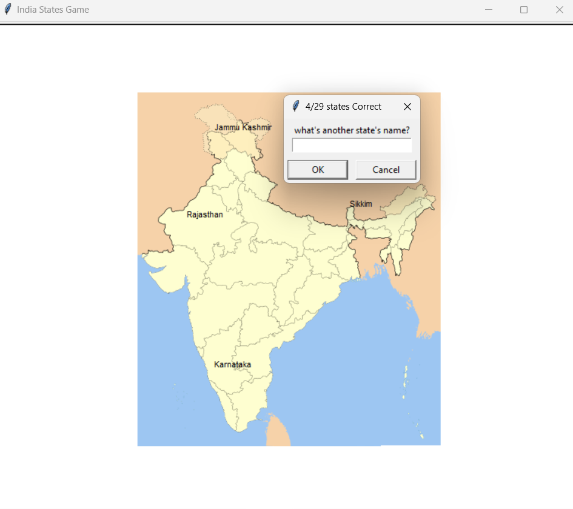

# Indian-states-guessing-game

Description:
A Python game using Turtle graphics for guessing Indian state names. Users input guesses, and correct answers are displayed on the India map. Exiting the game saves unguessed states to a file for future learning.

# sample image

  

